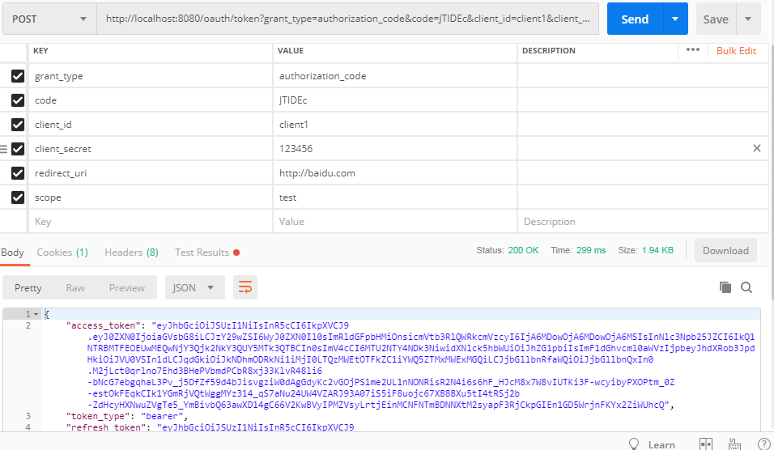
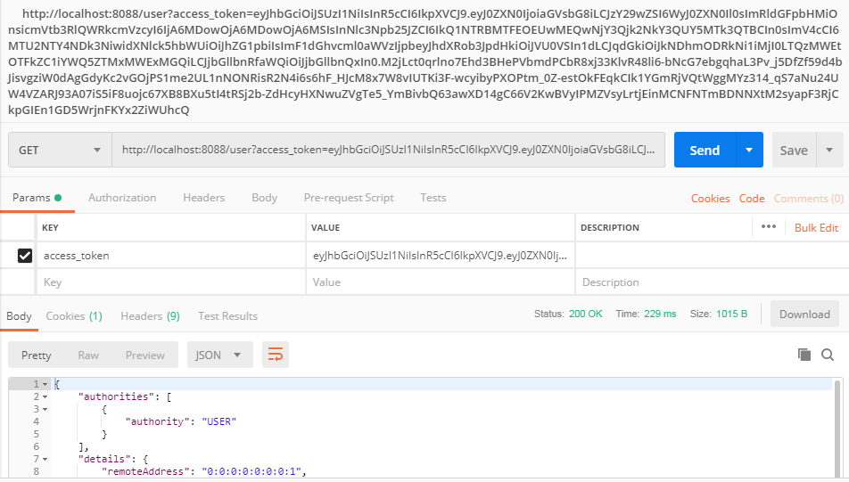

# Getting Started

### Reference Documentation
For further reference, please consider the following sections:

* [Official Apache Maven documentation](https://maven.apache.org/guides/index.html)

## 

JSON Web Token（JWT）是目前最流行的跨域身份验证解决方案
#### Base64URL算法
如前所述，JWT头和有效载荷序列化的算法都用到了Base64URL。该算法和常见Base64算法类似，稍有差别。
作为令牌的JWT可以放在URL中（例如api.example/?token=xxx）。
Base64中用的三个字符是"+"，"/"和"="，由于在URL中有特殊含义，因此Base64URL中对他们做了替换："="去掉，"+"用"-"替换，"/"用"_"替换，这就是Base64URL算法，很简单把。
#### JWT的用法
客户端接收服务器返回的JWT，将其存储在Cookie或localStorage中。
此后，客户端将在与服务器交互中都会带JWT。如果将它存储在Cookie中，就可以自动发送，但是不会跨域，
因此一般是将它放入HTTP请求的Header Authorization字段中。
Authorization: Bearer
当跨域时，也可以将JWT被放置于POST请求的数据主体中。

## 参考
https://www.jianshu.com/p/fe67b4bb6f2c
