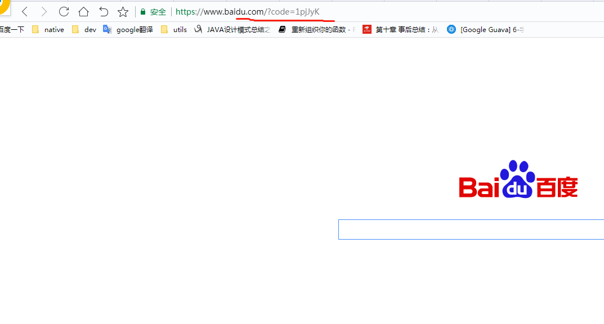

# Getting Started
### Reference Documentation
For further reference, please consider the following sections:
* [Official Apache Maven documentation](https://maven.apache.org/guides/index.html)

##
在浏览器输入:
http://localhost:8080/oauth/authorize?response_type=code&client_id=client1&redirect_uri=http://baidu.com

## 参考
https://blog.csdn.net/aaronsimon/article/details/83546827
https://github.com/spring2go/oauth2lab
https://www.cnblogs.com/sky-chen/archive/2019/03/13/10523882.html

