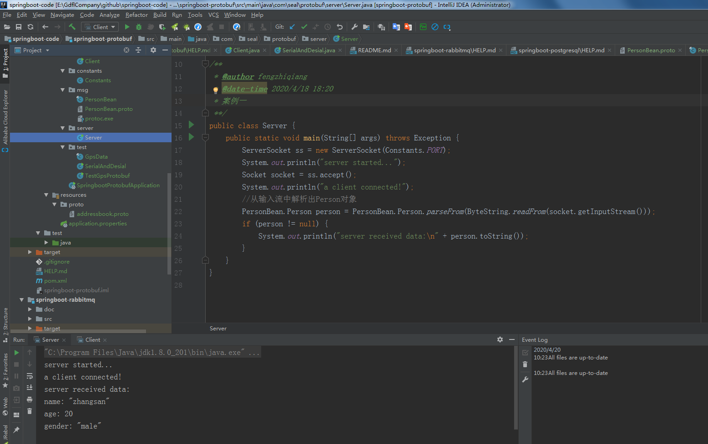
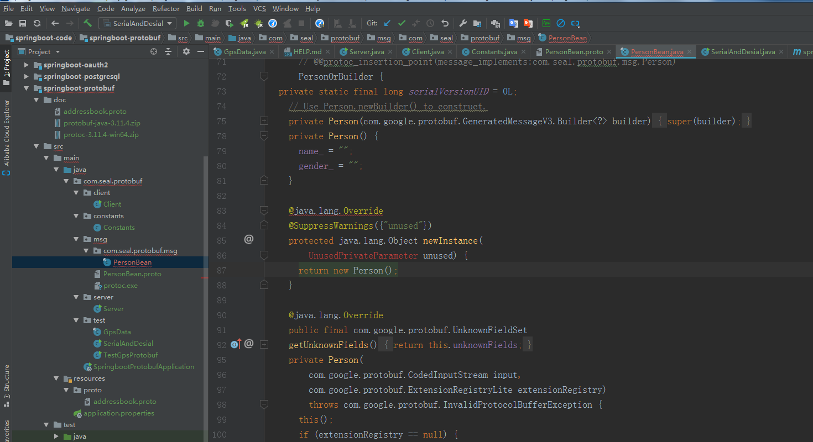

# Java中使用Protocol Buffer 
在Java中使用ProtocolBuffer的步骤大致分为下面这几点：
* （1）编写.proto文件，定义消息类型
* （2）使用ProtocolBuffer的编译器，将.proto文件编译成对应的java文件
* （3）在Java代码中使用上一步编译好的java文件
## 案例一
生成了对应的java文件PersonBean.java
```
E:\GdflCompany\github\springboot-code\springboot-protobuf\src\main\java\com\seal\protobuf\msg>protoc.exe --java_out=./ PersonBean.proto
```
1.先启动Server
2.再启动Client

https://www.cnblogs.com/blythe/articles/8473016.html

## 案例二
## 案例三
```
E:\GdflCompany\github\springboot-code\springboot-protobuf\src\main\java\com\seal\protobuf\msg>protoc.exe --java_out=./ ProtoDemo.proto

```
# 总结
### protoc生成的序列化文件报错

出现这个问题是因为生成器的版本和maven版本不一致，改为一致。
