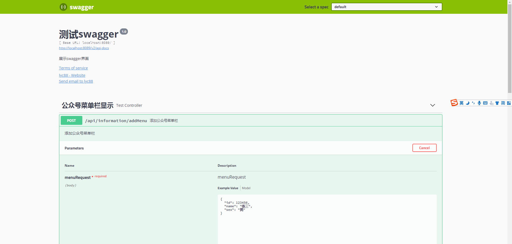
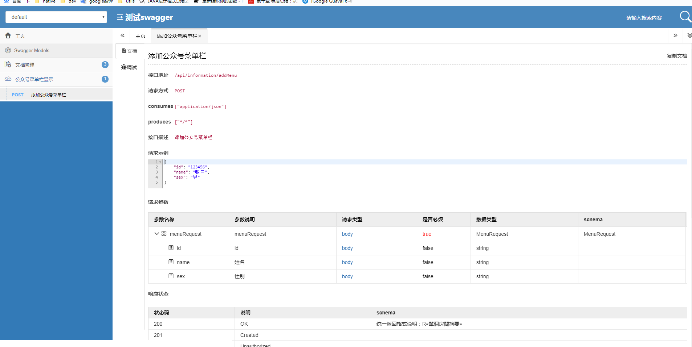

## 接口文档之 springboot 集成 swagger 和 swagger-bootstrap-ui
@Api：用在类上，说明该类的作用。
@ApiOperation：注解来给API增加方法说明。
@ApiImplicitParams : 用在方法上包含一组参数说明。
@ApiImplicitParam：用来注解来给方法入参增加说明。
@ApiResponses：用于表示一组响应
@ApiResponse：用在@ApiResponses中，一般用于表达一个错误的响应信息
  *  code：数字，例如400
  *  message：信息，例如"请求参数没填好"
  *  response：抛出异常的类
@ApiModel：描述一个Model的信息（一般用在请求参数无法使用@ApiImplicitParam注解进行描述的时候）
  *  @ApiModelProperty：描述一个model的属性
注意：@ApiImplicitParam的参数说明：
   paramType：指定参数放在哪个地方
   header：请求参数放置于Request Header，使用@RequestHeader获取
   query：请求参数放置于请求地址，使用@RequestParam获取
   path：（用于restful接口）-->请求参数的获取：@PathVariable
   body：（不常用）
   form（不常用）
   name：参数名
   dataType：参数类型
   required：参数是否必须传   true | false
   value：说明参数的意思
   defaultValue：参数的默认值
 
## 排除静态文件
registry.addResourceHandler("swagger-ui.html")
        .addResourceLocations("classpath:/META-INF/resources/");

registry.addResourceHandler("doc.html").addResourceLocations("classpath:/META-INF/resources/");

registry.addResourceHandler("/webjars/**")
        .addResourceLocations("classpath:/META-INF/resources/webjars/");
        
## 例子 

http://localhost:8089/swagger-ui.html

http://localhost:8089/doc.html

## 参考
https://gitee.com/xiaoym/swagger-bootstrap-ui
https://www.cnblogs.com/lyc88/articles/11017540.html